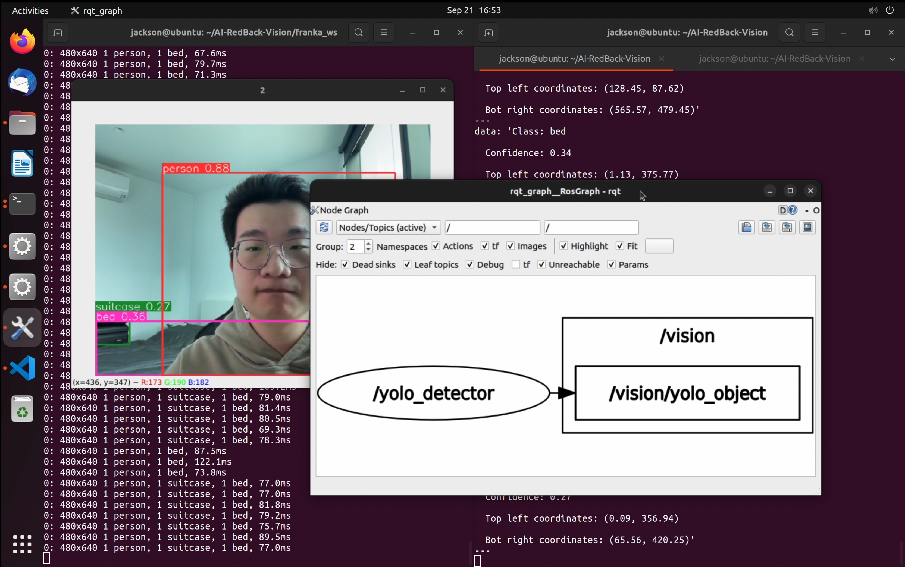

# AI-RedBack-Vision
[![humble][humble-badge]][humble]
[![ubuntu22][ubuntu22-badge]][ubuntu22]
<!-- ALL-CONTRIBUTORS-BADGE:START - Do not remove or modify this section -->
[](#contributors-)
<!-- ALL-CONTRIBUTORS-BADGE:END -->
## Overview
The aim of this repo is to develop the visual components of the AI-RedBack project. The code should allow the robot to perceive and interpret its surroundings through cameras, enabling it to make informed decisions, through the identification of objects and human gestures.

## ROS2 Nodes
There are two ROS nodes in this repository:
1. 3D object detection
2. Human posture detection (hand gesture, gaze)

## Installation
<details>
  <summary>
    Step 1: Install Ubuntu 22.04 LTS (Jammy Jellyfish)
  </summary>
  
- Head to [Ubuntu release page](https://releases.ubuntu.com/jammy/) and download the “Desktop Image”
- Can either install via
  - Bootable USB flash drive
  - Virtual Machine
  - WSL
    
</details>

<details>
  <summary>
    Step 2: Configure ROS2 environment 
  </summary>
  
- Open the [official documentation](https://docs.ros.org/en/humble/Installation.html) of ROS Humble for installation instructions
    
</details>

<details>
  <summary>
    Step 3: Install required packages for object detection
  </summary>
  
- Please use `pip` to install the following packages
```
ultralytics >= 8.0
```
    
</details>

<details>
  <summary>
    Step 4: Install required packages for human posture detection
  </summary>
  
- Please use `apt-get`/'apt' to install the following packages
```
cmake-qt-gui
libopencv-dev
Caffe prerequisites (found in ./scripts/ubuntu/install_deps.sh)
protobuf-compiler
libgoogle-glog-dev
libboost-all-dev
libhdf5-dev
libatlas-base-dev
python3-dev

```
- Please use `pip` to install the following packages
```
numpy
opencv-python
```
</details>

## Usage
### Build
```
$ cd franka_ws
$ colcon build --symlink-install
```

### Run yolo_detector node
After successfully built, `yolo_detector` ROS2 node can be launched via the following command:
```
ros2 run object_detector yolo_detector
```
Details about `yolo_detector` can be found in [docs](./docs/yolo_object_detector.md)

<p align="center">
  
</p>

## Contributors

Thanks goes to these wonderful people ([emoji key](https://allcontributors.org/docs/en/emoji-key)):

<!-- ALL-CONTRIBUTORS-LIST:START - Do not remove or modify this section -->
<!-- prettier-ignore-start -->
<!-- markdownlint-disable -->
<table>
  <tbody>
    <tr>
      <td align="center" valign="top" width="14.28%"><a href="https://github.com/jackson-hu1279"><br /><sub><b>jackson-hu1279</b></sub></a><br /><a href="https://github.com/COMP90082-2023-SM2/AI-RedBack-Vision/commits?author=jackson-hu1279" title="Code">💻</a> <a href="https://github.com/COMP90082-2023-SM2/AI-RedBack-Vision/commits?author=jackson-hu1279" title="Documentation">📖</a></td>
      <td align="center" valign="top" width="14.28%"><a href="https://github.com/Tempest371"><br /><sub><b>Tempest371</b></sub></a><br /><a href="https://github.com/COMP90082-2023-SM2/AI-RedBack-Vision/commits?author=Tempest371" title="Code">💻</a> <a href="https://github.com/COMP90082-2023-SM2/AI-RedBack-Vision/commits?author=Tempest371" title="Documentation">📖</a></td>
    </tr>
  </tbody>
</table>

<!-- markdownlint-restore -->
<!-- prettier-ignore-end -->

<!-- ALL-CONTRIBUTORS-LIST:END -->

This project follows the [all-contributors](https://github.com/all-contributors/all-contributors) specification. Contributions of any kind welcome!


[humble-badge]: https://img.shields.io/badge/-HUMBLE-orange?style=flat-square&logo=ros
[humble]: https://docs.ros.org/en/humble/index.html
[ubuntu22-badge]: https://img.shields.io/badge/-UBUNTU%2022%2E04-blue?style=flat-square&logo=ubuntu&logoColor=white
[ubuntu22]: https://releases.ubuntu.com/jammy/
