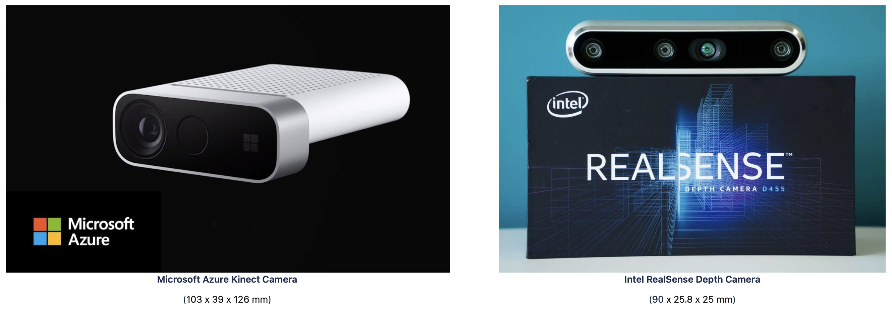
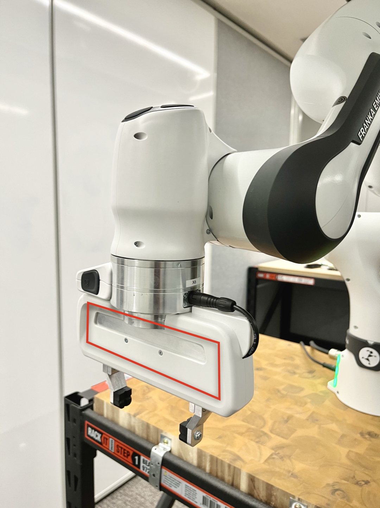
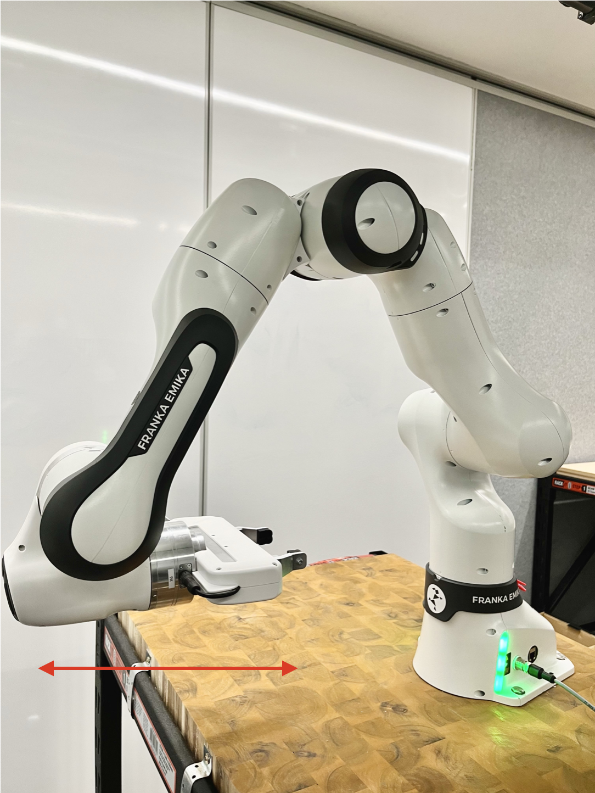
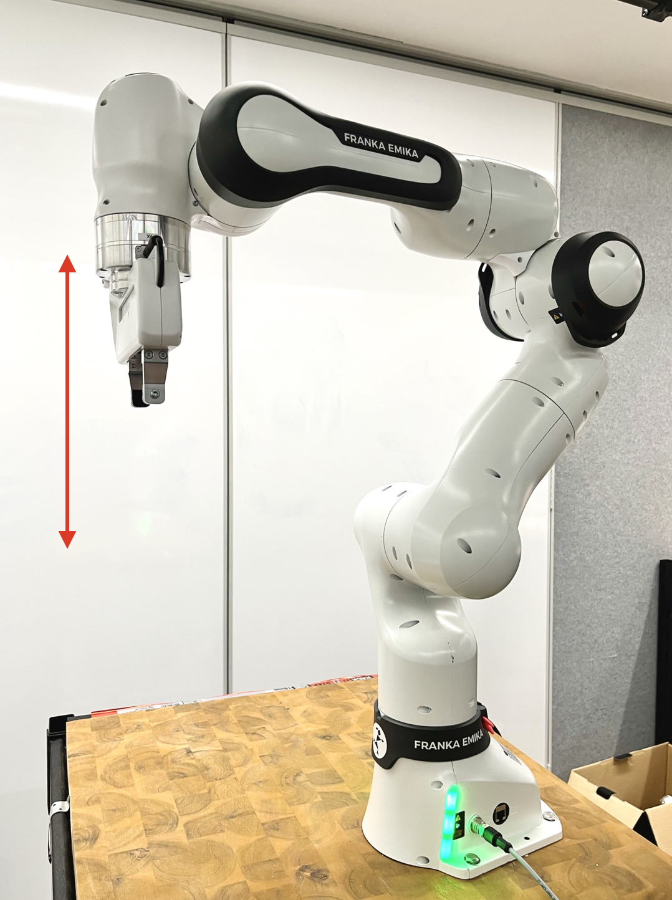
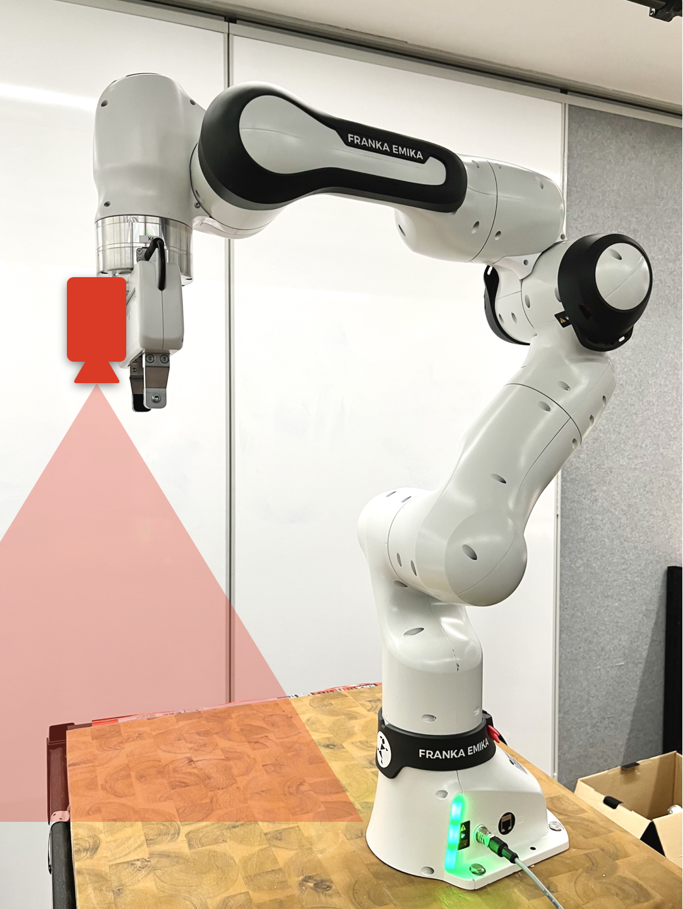

# Camera Mounting Analysis
## Background
We were advised to use the **Microsoft Azure Kinect** depth camera as the main sensor to collect visual information. However, due to the dimensions of Azure Kinect, we could not mount it on the robotic arm expecting it to move along with the robotic arm. Therefore our client suggested considering using an **Intel RealSense** camera instead to capture depth information. 

  

## Analysis
We examined the robotic arm for all potential places to attach the camera. Since we expect the camera will move together with the robotic arm so the most ideal place would be the robot end-effector where it's been marked as red in the image below:

  

We initially expected the robot end-effector would move horizontally where the camera attached on it will perceive a view similar to human eyes. While the Franka Emika robot is designed to operate vertically for majority of the scenarios like the image shown on the right.

  
  

So that means if we attach the depth camera on the robot end-effector, the camera will perceive a top-down point of view rather than the normal human eye observation perspective. The presumed camera perspective is demonstrated like the image below.

  

For such a camera setup, apart from the advantage of relative fixed position considering the movement of the robotic arm, it leads to potential issues that we may not encounter compared to attaching the camera to an external holder. A few positive and negative impacts are listed below comparing these two approaches:

### Mounted on robotic arm
Advantages:
1. Relative fixed camera position 
    - Consider camera as the "eyes" of robotic arm
    - Assume the visual perspective is the "front" of robotic arm
2. No need to track robot movement separately
3. Camera calibration is relatively easy

Disadvantages:
1. Impact on accuracy of object detection
    - Top-down view → rarely like the original objects
    - No computer vision models specifically trained for top-down view
    - May cause incorrect object labels
2. Need specifically designed mouting components
    - Existing 3D printed parts?
    - Design by our own?

### Mounted on external holders
Advantages:
1. No need to consider mouting issues
    - No need to design custom mounting components
2. Can pick an arbitrary holder
    - Existing hanging holder at the lab

Disadvantages:
1. Need to track robot movement separately
    - Since it's not "on" the robotic arm
    - Determine the real-time position of both robotic arm and target objects
2. Camera calibration is challenging
    - Camera position is not fixed
    - Need to calibrate every time before using it

## Approach
After comprehensive analysis of two approaches above, we also discussed with our client about this during client meeting. The client suggested it's possible to use two cameras rather than one. Therefore we decided to mount the **Intel ReaSense** depth camera on the robot end-effector and attach the **Microsoft Azure Kinect** camera on the hanging holder at the lab.
- The **Microsoft Azure Kinect** camera will be responsible for collecting RGB visual input and handle both object detection (labelling) and human gesture tracking.
- The **Intel RealSense** depth camera will majorly track the real-time relative position of target objects from the perspective of the robotic arm using the depth information captured.

In order to attach the **Intel RealSense** depth camera on the robotic arm, a custom mounting device should be designed and built. We will consider use a 3D printer to build this component for our purpose. 