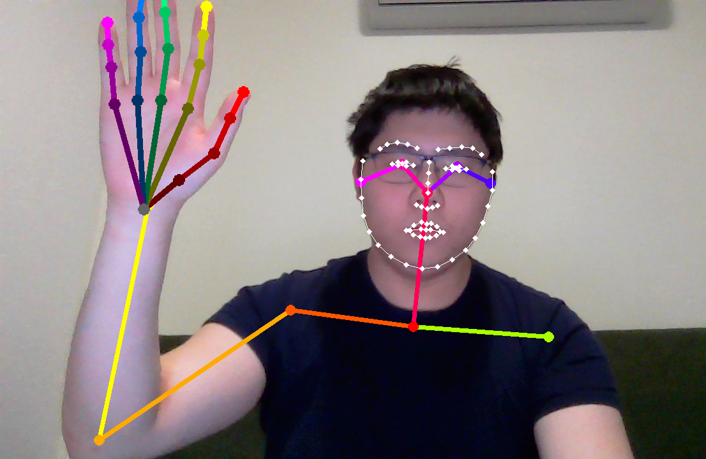
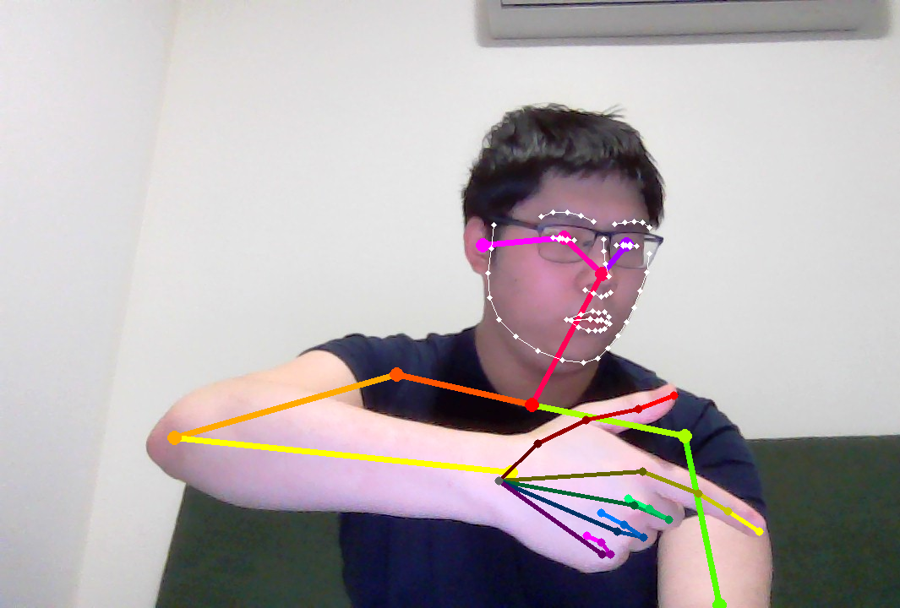
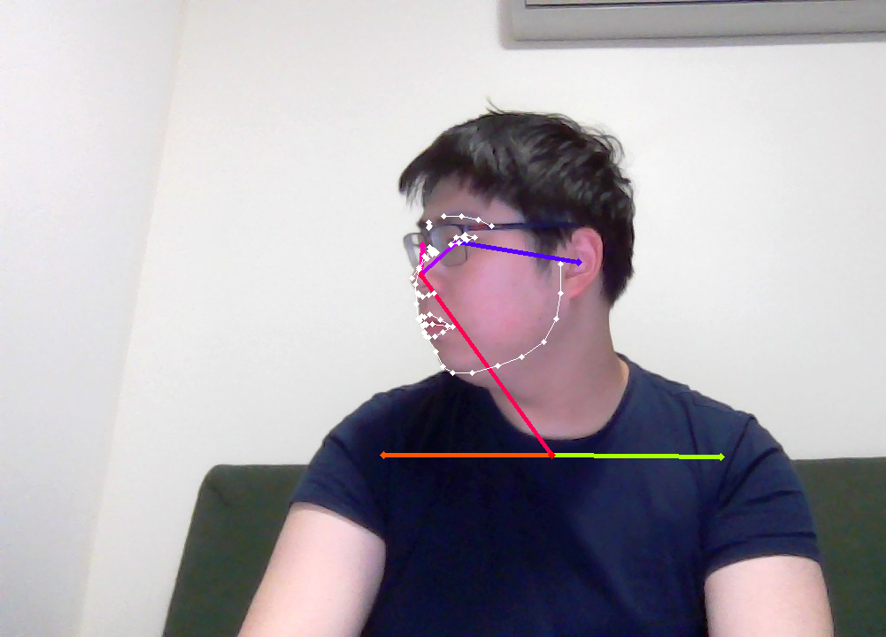

# Openpose

## Openpose link: https://github.com/CMU-Perceptual-Computing-Lab/openpose

## Running Openpose
./build/examples/openpose/openpose.bin

## Prerequisites

CMake GUI: sudo apt-get install cmake-qt-gui      
Nvidia GPU: Update to latest version      
CUDA: Download from website: https://developer.nvidia.com/cuda-11-7-1-download-archive    
cuDNN: Download from website: https://developer.nvidia.com/cudnn    
Caffe: sudo bash ./scripts/ubuntu/install_deps.sh     
OpenCV: sudo apt-get install libopencv-dev     
### Make prerequisites
- CMake config: sudo apt install protobuf-compiler libgoogle-glog-dev
- Openpose: sudo apt install libboost-all-dev libhdf5-dev libatlas-base-dev
### Python prerequisites
- sudo apt-get install python3-dev
- sudo pip3 install numpy opencv-python

## Openpose Flags
### Additional keypoints:
--face: Adds facial keypoints  
--hand: Adds hand keypoints  

### Input:
--video <path_to_video>: Runs openpose on a video  
--image_dir <path_to_folder>: Runs openpose on all images within a folder  
--camera <camera_number>: Selects which camera to run, if --video and --image_dir flags are not used  

### Output:
--write_video <path_to_video>: Records video to the path specified  
--write_images <path_to_folder>: Records images in the folder path specified  

### Examples:

  
  <figcaption>Openpose hand and face keypoint detection</figcaption>

  
  <figcaption>Openpose estimation of finger keypoints</figcaption>

  
  <figcaption>Openpose face keypoint detection (sideview)</figcaption>

