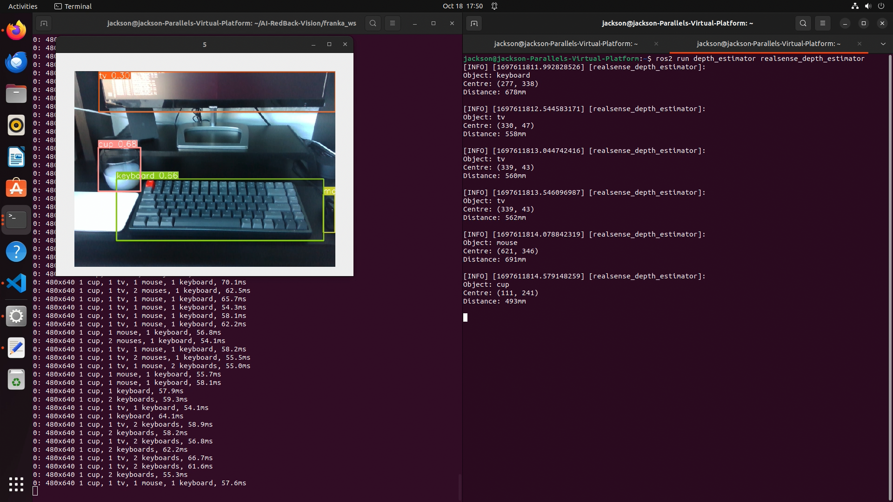
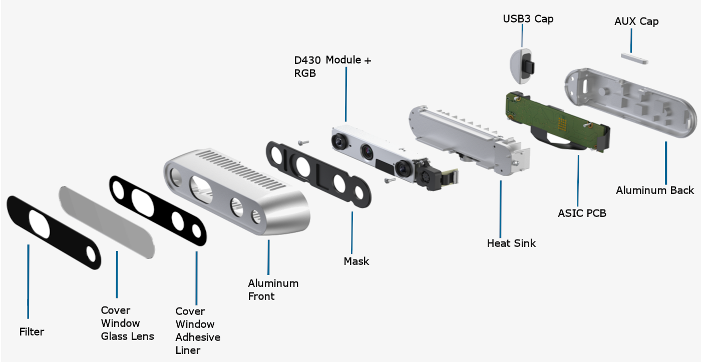
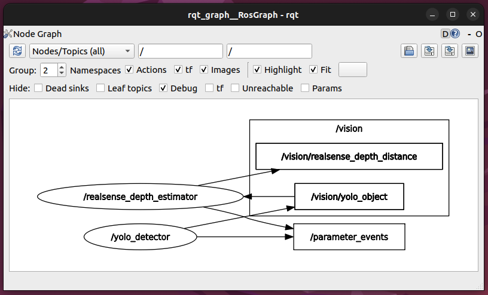
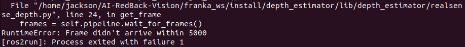

# RealSense Depth Estimator Node
## Overview
The `realsense_depth_estimator` node under the depth_estimator package attempts to estimate distance to the centre of recognised objects. The object distance information will be encapsulated into ROS 2 messages and published to a topic named `/vision/realsense_depth_distance`.

## Prerequisites
The additional distance information of objects in depth space can be captured by utilising the Intel RealSense depth camera, which will be attached on the end-effector of the Franka Emika robotic arm. Although Intel provides a [ROS wrapper](https://github.com/IntelRealSense/realsense-ros) for using RealSense cameras, `pyrealsense` was used instead to establish camera connection and access frame sequences due to its simplicity. 

This can remove unnecessary components built in Intel's official SDK so that only the essential camera channel will be accessed and used. `pyrealsense` can be installed using `pip`.
```
$ pip install pyrealsense
```

## Usage
1. Setting up the Workspace
    - Navigate to the ROS2 workspace
      ```shell
      cd franka_ws
      ```
    - Build packages
      ```shell
      colcon build --symlink-install
      ```
    - Source the setup file
      ```shell
      source install/setup.bash
      ```
2. Ensure the `yolo_detector` node is running and publishing object information to the `/vision/yolo_object` topic
    ```
    $ ros2 topic list
 
    /parameter_events
    /rosout
    /vision/yolo_object
    ```
3. Launch the `realsense_depth_estimator` node
    - After successfully built, `realsense_depth_estimator` ROS2 node can be launched via the following command:
      ```shell
      ros2 run depth_estimator realsense_depth_estimator
      ```
4. Check detected objects
    - The distance information corresponding to objects detected can be checked by inspecting the `/vision/realsense_depth_distance` topic with the command:
      ```shell
      ros2 topic echo /vision/realsense_depth_distance
      ```

<p align="center">
  
</p>


## Topic Subscribed
The `realsense_depth_estimator` node will first subscribe messages from `/vision/yolo_object` topic (published by node `yolo_detector`) to get the following information of detected objects:
- Object class
- Confidence rate
- Top left coordinates (pixel)
- Bottom right coordinates (pixel)


## Depth Distance Estimation
Intel RealSense depth camera can utilise its IR projector and left/right imagers to capture additional depth information which then will return a streaming depth frame containing the estimated distance value corresponds to each pixel coordinates.

The returned depth frame can be accessed once the connection to camera has established. By processing the top left and bottom right coordinates of detected objects which received from `/vision/yolo_object` topic, the centre pixel coordinates to each object can be calculated. 

The distance to the object centre can be simply extracted by accessing the depth value stored in camera depth frame at corresponding index (same as pixel coordinates).

<p align="center">
  
</p>

## Messages Published to Topic
The following command will list all active ROS 2 topics:
```
$ ros2 topic list

/parameter_events
/rosout
/vision/realsense_depth_distance
/vision/yolo_object
```

The object distance information will be encapsulated in the form of `std_msgs.msg.String` and published to `/vision/realsense_depth_distance` topic.

The published message will include the following:
- Object class
- Centre coordinates (pixel)
- Estimated distance (in mm)

We can launch `rqt_graph` to verify that the `realsense_depth_estimator` node is subscribing from `/vision/yolo_object` topic and publishing messages to topic `/vision/realsense_depth_distance` at the same time.


<p align="center">
  
</p>

## Release Notes
### Features
- Integrate distance estimation in depth space using Intel RealSense depth camera as a ROS2 node
- Subscribe coordinates information of detected objects from a ROS2 topic
- Continuously publish object distance information to a ROS2 topic

### Known Issues
1. Can't reconnect camera depth channel and receive depth frames if RGB channel didn't properly released from the last session.
    <p align="center">
      
    </p>

    - **Consequence:** Raise error `"RuntimeError: Frame didn't arrive within 5000"` 
    - **Reason:** Quit the `realsense_depth_estimator` node will release camera depth channel but can't release camera RGB channel (occupied by `yolo_detector` node)
    - **Workaround:** Re-plug the camera connection cable to reset camera connection

### Notes
- Please note that `pyrealsense` package **doesn't** support Linux with ARM architecture
- Please use Intel RealSense depth camera for both object detection and distance estimation
    - To ensure the same dimension of camera input
    - If use another camera for object detection, need to find a way for correct coordinates mapping
- Camera returned depth value may be invalid (as zero) sometimes, especially when too close to target objects
    - This is due to hardware limitation 
    - The code currently filters out the invalid depth value by simply blocking zero values
    - May need to come up a better approach to handle invalid depth values
- Camera returned depth value may change rapidly although no actual distance changed
    - This is due to hardware limitation 
    - May need to come up a better approach to process returned depth values (smoothing, averaging, filtering)

### Future Improvements
1. Attempt to establish depth channel connection although the RGB channel didn't properly released from the last session (occupied by `yolo_detector` node)
2. Find a better approach to process invalid, jumping depth values returned from the depth camera