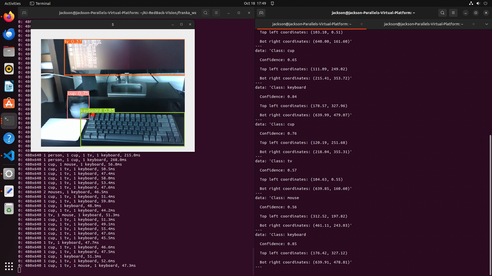
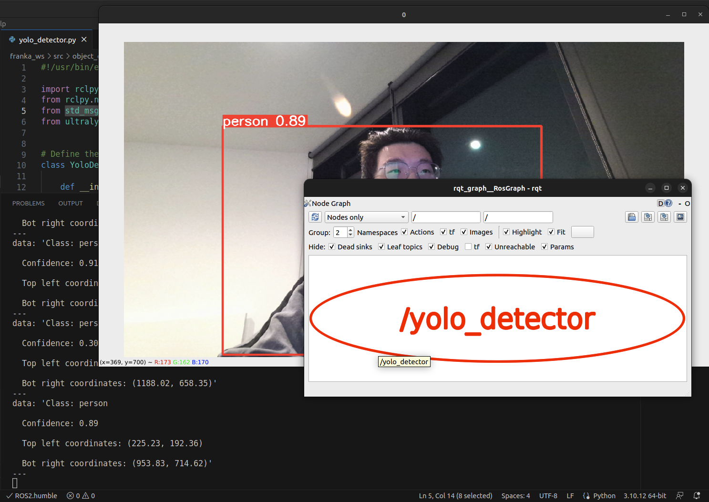
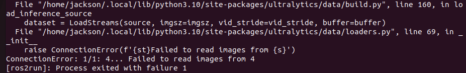
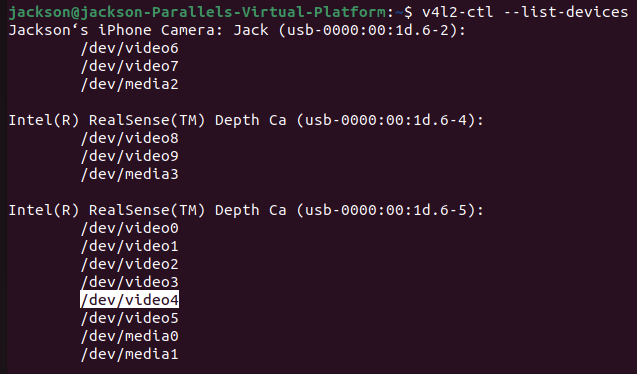

# YOLO Detector Node
## Overview
The `yolo_detector` node under the `object_detector` package will try to recognise and extract pixel coordinates of objects. The extracted information will be encapsulated into ROS 2 messages and published to a topic named `/vision/yolo_object`.

## Prerequisites
Ultralytics library is a prerequisite for using YOLO pre-trained models. PyTorch will also be installed as part of the dependencies since YOLO models are trained and supported by PyTorch.
Please install Ultralytics via pip to get started.
```
$ pip install ultralytics
```

## Usage
1. Setting up the Workspace
    - Navigate to the ROS2 workspace
      ```shell
      cd franka_ws
      ```
    - Build packages
      ```shell
      colcon build --symlink-install
      ```
    - Source the setup file
      ```shell
      source install/setup.bash
      ```
2. Launch the `yolo_detector` node
    - After successfully built, `yolo_detector` ROS2 node can be launched via the following command:
      ```shell
      ros2 run object_detector yolo_detector
      ```
3. Check detected objects
    - A window will show the RGB camera view with **object label**, and **confidence rate** around the boundary of detected objects.
    - The relevant information extracted from the objects detected can also be checked by inspecting the `/vision/yolo_object` topic with the command:
      ```shell
      ros2 topic echo /vision/yolo_object
      ```

<p align="center">
  
</p>

## Messages Published to Topic
The following command will list all active ROS 2 topics:
```
$ ros2 topic list

/parameter_events
/rosout
/vision/yolo_object
```

The relevant information extracted from the objects detected by YOLO models will be encapsulated in the form of `std_msgs.msg.String` and published to `/vision/yolo_object` topic every second (can be configured in code for higher frequency).

The published message will include the following:
- Object class
- Confidence rate
- Top left coordinates (pixel)
- Bottom right coordinates (pixel)

While the YOLO is configured to show the real-time object detection results on screen, we can launch `rqt_graph` to verify that node `yolo_detector` is active and publishing messages as expected.


<p align="center">
  
</p>

## Release Notes
### Features
- Integrate YOLO streaming object detection as a ROS2 node
- Mark detected objects with object labels, confidence rates and boundaries on camera view in real time
- Continuously publish corresponding object information to a ROS2 topic

### Known Issues
1. Can't gracefully shutdown the node when force quit with `Ctrl + C`
    - **Reason:** Can't break the streaming object detection properly unless modify source code of YOLO
2. Can't disconnect camera channel properly when using Intel RealSense depth camera as video input and the node was force quit
    <p align="center">
      
    </p>

    - **Consequence:** Raise error `"ConnectionError: ... failed to read images from ..."`
    - **Reason:** Force quit the node will leave the device file occupied (by YOLO streaming loop), connection to camera can't be re-established
    - **Workaround:** Re-plug the camera connection cable to reset camera connection

### Notes
- Please set the correct device reference
    - First check all active devices for video input using the command:
      ```
      v4l2-ctl --list-devices
      ```
    - Find the correct video input device. If use Intel RealSense depth camera as video input, please find the corresponding RGB frame channel (usually the 5th one as highlighted below, but reference number could be different).
    <p align="center">
      
    </p>

    - Change the device reference number predefined in `yolo_detector.py` file
      ```python
      def detect_objects(self):
        # Define streaming source (e.g. camera dev number)
        # May need to try out for different ports
        camera_dev = '4'
    
        # Return a list of Results objects
        self.results_ = self.yolo_model_(source=camera_dev,
                        show=True,
                        boxes=True,
                        stream=True
                    )
      ```

### Future Improvements
1. Try to gracefully shutdown the node by correctly handling exceptions like force quit.
2. Properly release camera connection before shutdown the node.
3. Add arguments in node launch command to set video input device number, or dynamically find the correct device number in code.
4. Feed image frames subscribed from topics as input for YOLO object detection instead occupy camera channel for object detection only.