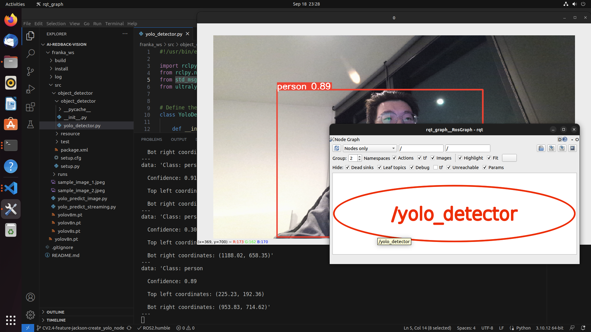

## Overview
The `yolo_detector` node under the `object_detector` package will try to recognise and extract pixel coordinates of objects. The extracted information will be encapsulated into ROS 2 messages and published to a topic named `/vision/yolo_object`.

## Prerequsite
Ultralytics library is a prerequisite for using YOLO pre-trained models. PyTorch will also be installed as part of the dependencies since YOLO models are trained and supported by PyTorch.
Please install Ultralytics via pip to get started.
```
$ pip install ultralytics
```

## Messages Published to Topic
The following command will list all active ROS 2 topics:
```
$ ros2 topic list

/parameter_events
/rosout
/vision/yolo_object
```

The relevant information extracted from the objects detected by YOLO models will be encapsulated in the form of `std_msgs.msg.String` and published to `/vision/yolo_object` topic every second (can be configured in code for higher frequency).

The published message will include the following:
- Object class
- Confidence rate
- Top left coordinates (pixel)
- Bottom right coordinates (pixel)

While the YOLO is configured to show the real-time object detection results on screen, we can launch `rqt_graph` to verify that node `yolo_detector` is active and publishing messages as expected.


<p align="center">
  
</p>
